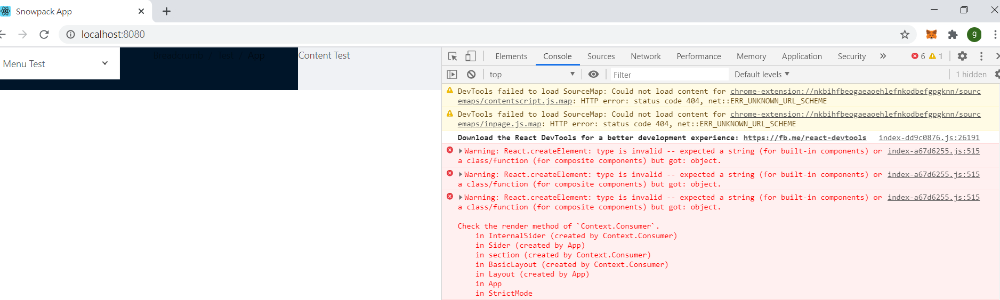
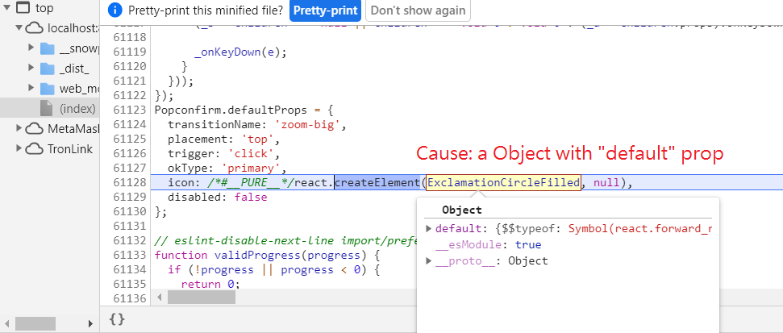
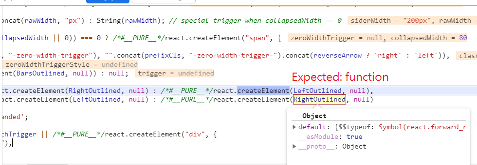

# ant-design-snowpack-issue

Issue: React.createElement: type is invalid -- expected a string (for built-in components) or a class/function (for composite components) but got: object.

Steps:

> npm install
> npm start

Screenshot

